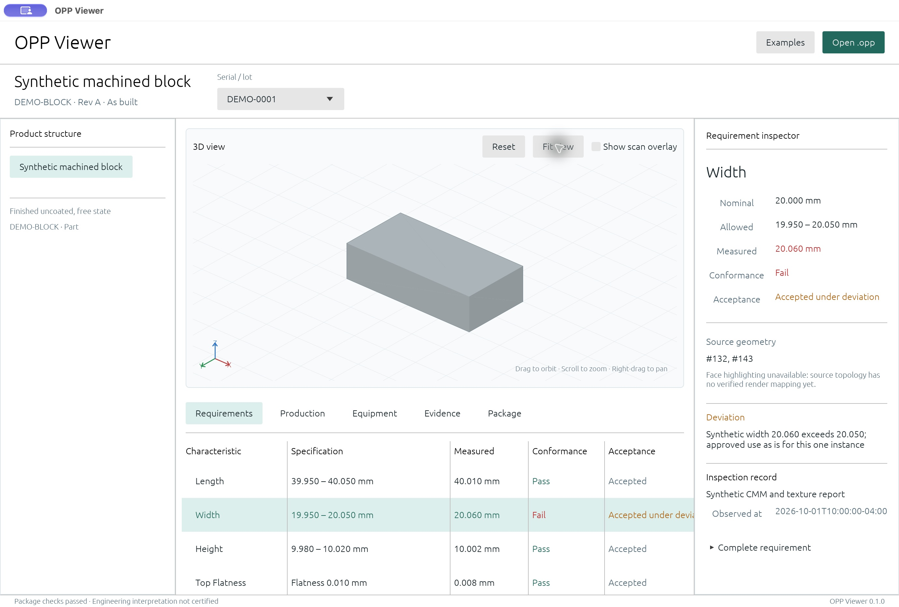

# OPP Viewer

A native Rust application for reviewing [Open Part Protocol](https://github.com/Open-Part-Protocol/open-part-protocol) `.opp` packages on Linux, Windows, and macOS.

Open a design or as-built package to inspect its product structure, nominal geometry, requirements, measurements, deviations, production history, equipment, and evidence. Files stay on your computer. Opening a package does not contact a service or modify the original.

**Status: first working prototype, supporting OPP `0.1.0-draft.1`.** The format and viewer are still under development. Package checks cover archive integrity, the embedded draft schemas, and selected record relationships. They do not establish engineering correctness, authenticity, full GD&T interpretation, or AS9102 certification.



## Run

Install [Rust](https://www.rust-lang.org/tools/install), then:

```sh
git clone https://github.com/Open-Part-Protocol/opp-viewer.git
cd opp-viewer
cargo run --release -- --demo
```

Open your own file with the **Open .opp** button, drag it into the window, or pass its path:

```sh
cargo run --release -- path/to/part.opp
```

On Debian/Ubuntu, install the native build libraries first:

```sh
sudo apt-get install build-essential pkg-config cmake libxkbcommon-dev libwayland-dev libx11-dev libxi-dev libxrandr-dev libxcursor-dev libgl1-mesa-dev liblzma-dev
```

Windows needs the MSVC Rust toolchain and Visual Studio C++ Build Tools. macOS needs the Xcode command line tools. A graphical desktop and working OpenGL driver are required for the native window; `--inspect` works without a window.

CI builds downloadable development bundles for each platform. Find them in the latest successful [Build and test](https://github.com/Open-Part-Protocol/opp-viewer/actions/workflows/ci.yml) run. These are unsigned development builds, not installers. The macOS bundle is an `.app`; Linux and Windows bundles contain the executable, sample packages, and notices.

## Review features

- Design and as-built records, including parts, nested assemblies, reused components, serials, and lots.
- Experimental STEP B-rep previews from the actual packaged geometry, with orbit, pan, zoom, fit, and component selection.
- Registered ASCII PLY point-cloud overlays for the selected physical subject.
- Requirements alongside recorded measurements, conformance, acceptance, and concessions. An approved deviation does not turn a failed result into a pass.
- Production events, material lots, equipment, calibrations, inspection/test runs, and recorded first article reports.
- Original evidence previews and save-copy controls, plus complete source document views.
- Offline inventory/SHA-256, schema, immutable design snapshot, occurrence path, calibration time, and selected evaluation checks.

Choose **Examples** to explore five bundled synthetic packages. They describe a simple 40 × 20 × 10 mm block, a reused nested assembly, and individual/lot actual records. Their measurements and approvals are illustrative.

## Current geometry limits

The initial pure Rust adapter uses [Truck](https://github.com/ricosjp/truck) for a subset of STEP Part 21 B-rep geometry. It does **not** implement complete AP242 PMI conversion. STEP length units must be explicit supported SI units; embedded STEP assembly transforms and mixed unit contexts are omitted with a warning. OPP component placements are supported.

The first nominal representation per product definition is previewed. Unsupported geometry leaves metadata available and displays a warning in **Package**. Source entity labels are shown, but individual face highlighting is disabled until topology-to-render mappings can be verified. See the [support matrix](docs/support.md) before using the viewer with real CAD exports.

## Development

```sh
cargo fmt --check
cargo clippy --all-targets --locked -- -D warnings
cargo test --locked
cargo run -- --inspect --demo
```

`--inspect` prints a JSON report and exits without opening a window. A failed package check exits with an error. The original package remains available for review after a failed open in the GUI.

The [architecture](docs/architecture.md), [verification record](docs/design/verification.md), and [contributing guide](CONTRIBUTING.md) explain the implementation and next steps. The authoritative draft schemas live in the protocol repository; this viewer embeds an exact [pinned snapshot](protocol/SOURCE.json).

## License and origin

Original viewer code is [Apache-2.0](LICENSE). This is an independent Rust implementation, with no SFA source or Windows-only SFA runtime. NIST SFA remains a standards reference in the protocol project; the unused fork is preserved as [opp-viewer-sfa-reference](https://github.com/Open-Part-Protocol/opp-viewer-sfa-reference). Dependency and fixture provenance is recorded in [THIRD_PARTY_NOTICES.md](THIRD_PARTY_NOTICES.md).
